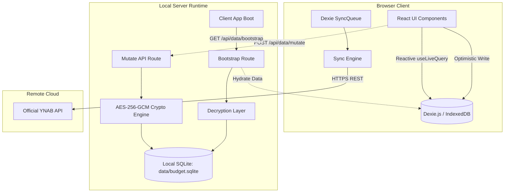
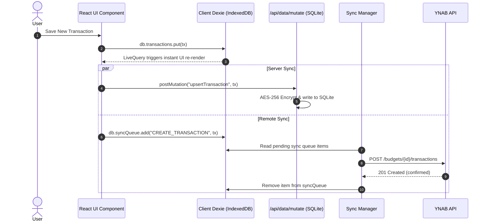

# YNAB Companion App Architecture & System Guidelines

This document outlines the architectural principles, data flow, storage strategies, and system design for the **YNAB Companion App**. It also provides a technical roadmap of recommended improvements to ensure long-term readability, testability, and expandability.

---

## 1. System Overview & Mental Model

The YNAB Companion App is designed as an **offline-first, snappy companion client** for YNAB (You Need A Budget). It is engineered to give users a fast, Mint-like daily interface for budgeting, tracking expenses, and viewing account balances without waiting for remote roundtrips.

### Core Tenets:
1. **Zero-Latency Reads**: All view data is served immediately from local reactive storage (Dexie IndexedDB in browser) with sub-50ms render times.
2. **Persistent Encrypted Local Cache**: An embedded SQLite database on the local Node.js server (`data/budget.sqlite`) acts as a secure, encrypted-at-rest persistence layer that survives browser cache clears and device reboots.
3. **Optimistic Local Mutations**: When a user creates or edits a transaction or budget, the UI updates instantly, records the mutation to local SQLite, and enqueues a background sync item for the remote YNAB API.
4. **Security by Default**: All sensitive financial amounts, account details, and the personal API access token are encrypted on disk with AES-256-GCM.

---

## 2. Multi-Tier Data Storage Architecture

The application employs a 3-tier storage model:



### Tier 1: Client Cache (IndexedDB via Dexie.js)
- **Role**: High-speed reactive query source for React components.
- **Library**: `dexie` and `dexie-react-hooks`.
- **Tables**: `plans`, `accounts`, `categoryGroups`, `categories`, `transactions`, `budgets`, `settings`, `syncQueue`.
- **Reactivity**: `useLiveQuery` triggers zero-overhead React component re-renders whenever database tables mutate.

### Tier 2: Encrypted Local Server Storage (Node.js SQLite)
- **Role**: Survives browser clearing, incognito sessions, and cross-browser usage on the host machine.
- **Engine**: Node.js native `node:sqlite` (`DatabaseSync`) in `WAL` (Write-Ahead Logging) mode.
- **Encryption**: AES-256-GCM authenticated encryption using a 256-bit key stored in `.env.local` (`ENCRYPTION_KEY`). Financial fields (`balance`, `amount`, `budgeted`, `activity`, `encrypted_token`) are encrypted before writing to disk.

### Tier 3: Upstream Cloud (YNAB REST API)
- **Role**: Authoritative remote financial truth.
- **Sync Model**: Delta sync using YNAB `server_knowledge` counters to fetch only changes since the last sync.

---

## 3. Data Flow & Synchronization Lifecycle

### 3.1 App Initialization (Bootstrap)
1. On initial mount, `useYNABData` triggers `db.initializeDefaults()`.
2. The client queries `/api/data/bootstrap`.
3. The server decrypts all tables from `data/budget.sqlite` and returns the hydrated snapshot.
4. Dexie bulk-populates local tables in a single transaction.
5. If the SQLite database is fresh/empty and no API token is configured, demo fixtures (`demo-data.ts`) are seeded.

### 3.2 Mutation Flow (Optimistic Write)
When an action occurs (e.g., adding a transaction or setting a category budget):
1. **Dexie Write**: Mutate local IndexedDB record immediately. UI updates instantly via `useLiveQuery`.
2. **Server Mutation**: `postMutation` fires an async request to `/api/data/mutate`. The server encrypts and writes the change to `data/budget.sqlite`.
3. **Sync Queue**: In non-demo mode, an operation is added to `syncQueue`.
4. **Remote Sync Worker**: The background sync manager flushes pending operations to the YNAB REST API when an internet connection is verified.



---

## 4. Current Architectural Debt & Friction Points

During our codebase audit, several architectural opportunities were identified:

### 4.1 Monolithic Page Component (`budgets-2/page.tsx`)
- **Problem**: `app/(tabs)/budgets-2/page.tsx` is over 2,500 lines in a single file. It mixes:
  - Date manipulation & month carousel logic
  - LocalStorage reading and writing for income categories
  - Direct calls to `YNABApiClient` instead of using the repository layer
  - Transaction classification (income vs expense vs transfer)
  - Inline modal states and form inputs
  - Deeply nested JSX rendering cards, tables, accordion rows, and charts
- **Impact**: Impedes maintainability, causes slow developer rebuilds, and prevents unit testing of core financial calculations.

### 4.2 Route Bifurcation (`/budget` vs `/budgets-2`)
- **Problem**: Both `/budget` (v1) and `/budgets-2` (v2) coexist in the top navigation ([`Header.tsx`](file:///c:/Users/jbmpa/git/ynab-companion-app/components/layout/Header.tsx)).
- **Impact**: Confuses users, duplicates styling logic, and maintains two diverging ways to view and edit budgets.

### 4.3 Direct `localStorage` Usage for Preferences
- **Problem**: Inflow/Income category configuration is saved in `localStorage.getItem("ynab_income_categories_${activePlanId}")`.
- **Impact**: Violates the offline SQLite encrypted persistence guarantee. Clearing browser data loses these preferences.

### 4.4 Loose Types (`any`) in Data Pipelines
- **Problem**: 58 ESLint errors stemming from `any` types in `lib/server/db.ts`, `lib/ynab/db.ts`, and `lib/ynab/sync.ts`.
- **Impact**: Compromises compile-time guarantees during data serialization, mutation, and SQLite storage.

---

## 5. Architectural Improvements & Refactoring Roadmap

To ensure high expandability (e.g., adding net worth charts, recurring bill tracking, rule engines, or AI financial categorization), we adopt the following target architecture:

### 5.1 Domain-Driven Feature Decomposition (Completed)
Decomposed the monolithic 2,536-line page into the modular feature package:

```
components/ynab/budget/
├── AdjustmentsAndStartingBalancesSection.tsx # Balance adjustments and starting balances
├── BudgetKpiCards.tsx                       # Top stat cards (Income, Spending, Net Cashflow, Budgeted)
├── CategorySpendingSection.tsx              # Categories list with progress & inline edits
├── DistributionCharts.tsx                   # Reality vs Budget side-by-side distribution pie charts
├── IncomeBreakdownSection.tsx               # Inflow totals, payee/category drill-down
├── MonthNavigator.tsx                       # Previous/Next month selector & ribbon
├── TransfersSection.tsx                     # Inter-account transfer pairs
├── constants.ts                             # Color palettes and constants
├── index.ts                                 # Barrel export
├── types.ts                                 # Domain-specific budget breakdown interfaces
└── useBudgetCalculations.ts                 # Pure calculation hook (spent, income, transfers)
```

### 5.2 Consolidate Budget Routing (Completed)
- Promoted the modularized v2 budget experience to become the primary [`/budget`](file:///c:/Users/jbmpa/git/ynab-companion-app/app/(tabs)/budget/page.tsx) route.
- Deprecated `/budgets-2` with a Next.js `redirect("/budget")`.
- Cleaned up [`Header.tsx`](file:///c:/Users/jbmpa/git/ynab-companion-app/components/layout/Header.tsx) navigation to only display:
  - **Dashboard** (`/dashboard`)
  - **Budget** (`/budget`)
  - **Transactions** (`/transactions`)

### 5.3 Centralize Settings in `AppSettings` Schema (Completed)
- Extended `AppSettings` in `lib/ynab/types.ts`:
  ```typescript
  export interface AppSettings {
    id: "app_settings";
    api_token: string;
    selected_plan_id: string;
    selected_plan_name?: string;
    is_demo_mode: boolean;
    last_server_knowledge: number;
    last_synced_at: string | null;
    income_category_ids_by_plan?: Record<string, string[]>;
  }
  ```
- Added `encrypted_income_categories TEXT` column to the server-side SQLite `settings` table with AES-256-GCM encryption at rest.
- Implemented `db.saveIncomeCategories(planId, categoryIds)` to update both Dexie and server SQLite.
- Completely eliminated all browser `localStorage` calls across the application.

### 5.4 Formalize Data Access Layer (DAL) & Discriminated Mutations
Replace loose `postMutation(action: string, payload: any)` with strongly typed action contracts:

```typescript
export type MutationPayload =
  | { action: "upsertTransaction"; payload: TransactionDetail }
  | { action: "deleteTransaction"; payload: { id: string } }
  | { action: "saveBudget"; payload: Budget }
  | { action: "updateSettings"; payload: Partial<AppSettings> };

export async function postServerMutation(mutation: MutationPayload): Promise<void> {
  // Strongly typed client-to-server dispatch
}
```

---

## 6. Security & Key Management

- **Storage of Key**: The AES-256 encryption key is stored in `.env.local` as `ENCRYPTION_KEY=<64-hex-characters>`.
- **Auto-Provisioning**: On startup, `lib/server/crypto.ts` checks for the key; if absent, it cryptographically generates a 256-bit random key, writes it to `.env.local`, and loads it immediately.
- **Payload Encryption**: All JSON objects containing user financial data (budgets, transactions, category targets) are serialized, encrypted with `aes-256-gcm`, and stored as `encrypted_data` along with a unique initialization vector (`iv`) and authentication tag (`auth_tag`).
- **Server-Only Crypto**: Encryption and decryption logic is contained strictly within `lib/server/` and is never bundled into client browser bundles.

---

## 7. Testing & Verification Strategy

- **Static Analysis**: ESLint with zero-tolerance for explicit `any` and strict React 19 hook checks.
  ```bash
  npm run lint
  ```
- **Type Checking**:
  ```bash
  npx tsc --noEmit
  ```
- **Production Build Verification**:
  ```bash
  npm run build
  ```
